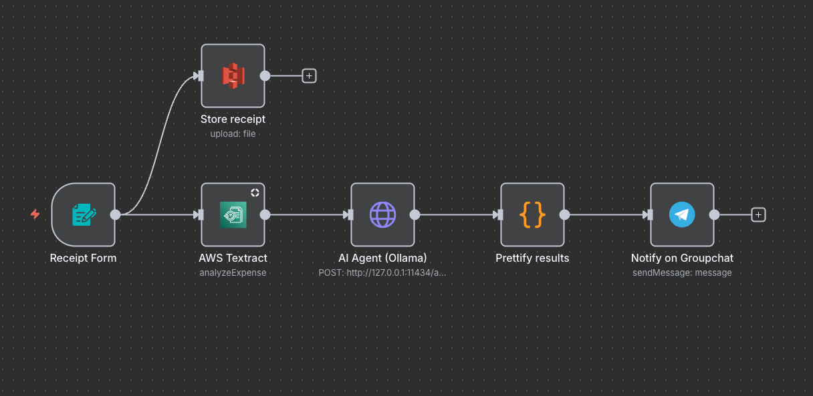

AI-powered Business Receipt Parser using n8n, AWS Textract, AWS S3 bucket and Ollama (Local LLM)
==================================================================================================

Upload a receipt image -> store the receipt to aws s3 bucket -> extract fields with AWS Textract -> structure & categorize with Ollama (local LLM) -> send a friendly summary to Telegram. No paid LLMs required.

Note. You can easily replace Ollama with OpenAi as an alternative.



---

## Watch Project Overview

[](https://www.youtube.com/watch?v=cmCKLKDLEeY)

---

Features
-----------
- Upload .jpg/.jpeg/.png via n8n Form
- Extract totals, date, vendor via AWS Textract (Analyze Expense)
- Structure + categorize via Ollama (llama3 or any local model)
- Send a smart summary to a Telegram group
- All local-friendly: no OpenAI key needed though AWS account is needed

## Architecture
---

```
n8n Form (file)
    └──▶ AWS S3 Bucket (Store Receipt)
    └──▶ AWS Textract (Analyze Expense)
        └──▶ HTTP Request → Ollama (localhost:11434/api/generate)
            └──▶ Code (Python) → Parse JSON from Model
                └──▶ Telegram Send Message (Group Chat)
```


Prerequisites
----------------
- n8n (self-hosted, local is fine)
- AWS account with Textract enabled + IAM creds (Access Key, Secret)
- AWS s3 bucket with the right group policies
- Ollama installed + a model pulled (e.g., ollama pull llama3)
- Telegram bot + bot token + target chat/group ID
- macOS/Linux/WSL; Firewall off or allowed for local calls

## Install & Run
---

### Install n8n
```bash
npm install -g n8n
n8n
```
Then open in your browser:  
[http://localhost:5678](http://localhost:5678)

---

### Install Ollama (Local AI)
```bash
ollama pull llama3
ollama serve
```

---

### Configure AWS in n8n
Create a credential named **“AWS account”** with:  
- Access Key  
- Secret Key  
- Region (e.g., `us-east-1`)

### Telegram Bot + Chat ID
- Create bot via @BotFather -> get bot token
- Add bot to group
- Get chat ID via @getidsbot or getUpdates API
- Save chatId and bot token in Telegram credentials in n8n

Import the Workflow
-----------------------
Import the JSON in n8n and replace placeholders with the correct credentials:
- your AWS credential ID
- your Telegram credential ID
- your Telegram chat/group ID

Run It
----------
1. Open Receipt Form node -> click public test URL or activate workflow.
2. Upload a .jpg/.jpeg/.png.
3. Watch the execution: Textract -> Ollama -> Python -> Telegram.

Example Telegram Message
---------------------------
You purchased from Walmart on 11/13/17.
Total: CAD23.19. Category: Groceries. Expense Type: Personal

Security & Notes
-------------------
- Use http://127.0.0.1:11434 for Ollama (not http://localhost:11434).
- Add Basic Auth to n8n in production.
- For PDFs, use S3 or Textract PDF operation.

Troubleshooting
-------------------
- HTTP Request “service refused”: use IPv4 address.
- JSON errors: ensure escaped quotes.
- Telegram issues: verify bot in group + chatId.

Roadmap / Ideas
-------------------
- Save JSON to Supabase/MySQL
- Weekly Telegram digest
- Currency detection

Security Disclaimer
----------------------
This repository does not include any sensitive credentials, access keys, or production configurations.
All connection details (AWS, Telegram, Ollama, etc.) are placeholders for demonstration purposes only.

When setting up this workflow in your own environment, make sure to:
• Store all credentials securely inside n8n’s Credentials Manager
• Never hardcode access keys, tokens, or secrets directly in workflow nodes or code
• Use test accounts or sandbox environments when experimenting

Kodelle Inc. and Jawwad Ahmed Abbasi assume no responsibility for security misconfigurations in user deployments.

License
-----------
Proprietary License - All Rights Reserved
© 2025 Jawwad Ahmed Abbasi, Kodelle Inc.

This project is protected under a proprietary license.
You may view and learn from the source code for educational or portfolio purposes,
but commercial use, modification, or redistribution requires a paid license or written permission.

For licensing or commercial use inquiries: jawwad@kodelle.com